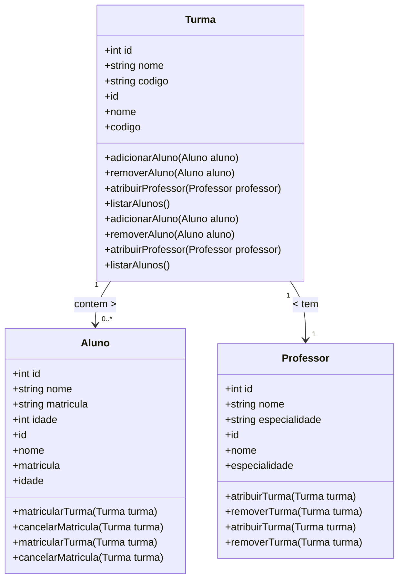

# Material



```yaml

nav:

  - 'index.md'

  - 'about.md'

```

!!! bug

Lorem

 ipsum dolor sit amet, consectetur adipiscing elit. Nulla et euismod

nulla. Curabitur feugiat, tortor non consequat finibus, justo purus

auctor massa, nec semper lorem quam in massa.

<figuremarkdown="span">

  { width="300" }

<figcaption>Image caption</figcaption>

</figure>

- [X] Lorem ipsum dolor sit amet, consectetur adipiscing elit
- [ ] Vestibulum convallis sit amet nisi a tincidunt

  * [X] In hac habitasse platea dictumst
  * [X] In scelerisque nibh non dolor mollis congue sed et metus
  * [ ] Praesent sed risus massa
- [ ] Aenean pretium efficitur erat, donec pharetra, ligula non scelerisque

```py

defbubble_sort(items):

    for i inrange(len(items)):

        for j inrange(len(items) -1- i):

            if items[j] > items[j +1]:

                items[j], items[j +1] = items[j +1], items[j]`

```

```py

defbubble_sort(items):

    for i inrange(len(items)):

        for j inrange(len(items) -1- i):

            if items[j] > items[j +1]:

                items[j], items[j +1] = items[j +1], items[j]

```

<divclass="grid cards"markdown>

- :fontawesome-brands-html5: __HTML__ for content and structure
- :fontawesome-brands-js: __JavaScript__ for interactivity
- :fontawesome-brands-css3: __CSS__ for text running out of boxes
- :fontawesome-brands-internet-explorer: __Internet Explorer__ ... huh?

</div>

<divclass="grid cards"markdown>

- :material-clock-fast:{ .lg .middle } __Set up in 5 minutes__

  ---

  Install [`mkdocs-material`](#) with [`pip`](#) and get up

  and running in minutes

  [:octicons-arrow-right-24: Getting started](#)
- :fontawesome-brands-markdown:{ .lg .middle } __It's just Markdown__

  ---

  Focus on your content and generate a responsive and searchable static site

  [:octicons-arrow-right-24: Reference](#)
- :material-format-font:{ .lg .middle } __Made to measure__

  ---

  Change the colors, fonts, language, icons, logo and more with a few lines

  [:octicons-arrow-right-24: Customization](#)
- :material-scale-balance:{ .lg .middle } __Open Source, MIT__

  ---

  Material for MkDocs is licensed under MIT and available on [GitHub]

  [:octicons-arrow-right-24: License](#)

</div>
