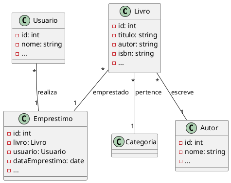

## Introdução ao SQLite: Seu Primeiro Banco de Dados

**O que é SQLite?**

SQLite é um sistema gerenciador de banco de dados relacional, leve e embutido. Isso significa que ele não requer um servidor separado para funcionar e pode ser integrado diretamente a um aplicativo. Ele é amplamente utilizado em dispositivos móveis, aplicativos desktop e até mesmo em sistemas embarcados.

**Por que usar SQLite?**

* **Simplicidade:** Fácil de aprender e usar, especialmente para iniciantes em bancos de dados.
* **Leveza:** Não exige um servidor dedicado, economizando recursos.
* **Velocidade:** Muito rápido para pequenas a médias bases de dados.
* **Portabilidade:** Funciona em praticamente todas as plataformas.
* **Transacional:** Garante a integridade dos dados através de transações.

**Conceitos Básicos:**

* **Banco de dados:** Uma coleção organizada de dados.
* **Tabela:** Uma estrutura dentro do banco de dados que armazena dados em linhas (registros) e colunas (campos).
* **Registro:** Uma linha em uma tabela, representando um conjunto de dados relacionados.
* **Campo:** Uma coluna em uma tabela, representando um tipo específico de dado (texto, número, data, etc.).
* **Chave primária:** Um campo ou conjunto de campos que identifica de forma única cada registro em uma tabela.
* **SQL (Structured Query Language):** A linguagem padrão para interagir com bancos de dados relacionais, incluindo o SQLite.

**Criando seu primeiro banco de dados SQLite:**

1\. **Escolha uma ferramenta:** Você pode usar um editor de texto para criar arquivos SQLite (com extensão .db) ou uma ferramenta gráfica como o SQLite Studio.

2\. **Conecte-se ao banco de dados:** Se estiver usando uma ferramenta gráfica, você precisará indicar o caminho para o seu arquivo SQLite.

3\. **Crie uma tabela:** Use a linguagem SQL para definir a estrutura da tabela, especificando o nome da tabela e os campos que ela conterá. Por exemplo:

```sql
CREATE TABLE pessoas (
    id INTEGER PRIMARY KEY,
    nome TEXT,
    idade INTEGER
);
```

4\. **Insira dados:** Use a instrução INSERT para adicionar registros à tabela. Por exemplo:

```sql
INSERT INTO pessoas (nome, idade)
VALUES ('João', 30);
```

5\. **Consulte dados:** Use a instrução SELECT para recuperar dados da tabela. Por exemplo:

```sql
SELECT * FROM pessoas;
```

**Exemplo prático em Python:**

```python
import sqlite3

# Conectando ao banco de dados
conn = sqlite3.connect('meu_banco.db')

# Criando um cursor para executar comandos SQL
cursor = conn.cursor()

# Criando a tabela (se não existir)
cursor.execute('''
    CREATE TABLE IF NOT EXISTS produtos (
        id INTEGER PRIMARY KEY,
        nome TEXT,
        preco REAL
    )
''')

# Inserindo dados
cursor.execute("INSERT INTO produtos (nome, preco) VALUES ('Celular', 1500)")

# Consultando dados
cursor.execute("SELECT * FROM produtos")
for row in cursor:
    print(row)

# Fechando a conexão
conn.close()
```

**Recursos adicionais:**

* **Documentação oficial:** [https://www.sqlite.org/](https://www.sqlite.org/)
* **Tutoriais online:** Existem diversos tutoriais gratuitos e pagos disponíveis na internet.
* **Ferramentas gráficas:** SQLite Studio, DB Browser for SQLite, etc.

---

## Planejando um Banco de Dados: Um Guia Completo

**Planejamento é a chave para um banco de dados eficiente e escalável.** Ao criar um banco de dados, é fundamental ter uma visão clara de como os dados serão armazenados, como serão acessados e como o banco de dados irá evoluir ao longo do tempo.

### Etapas do Planejamento

1\. **Definição dos Requisitos:**

   * **Quais dados serão armazenados?** Identifique todos os tipos de dados que serão armazenados no banco de dados (nomes, endereços, datas, etc.).
   * **Quem vai usar o banco de dados?** Determine os usuários e suas necessidades específicas.
   * **Como os dados serão utilizados?** Quais tipos de consultas serão realizadas? Quais relatórios serão gerados?
   * **Quais são as restrições de segurança?** Quais dados precisam ser protegidos e como?
  
2\. **Modelagem de Dados:**

   * **Entidades e Atributos:** Identifique as entidades (tabelas) e seus atributos (colunas).
   * **Relacionamentos:** Defina como as entidades se relacionam entre si (um para um, um para muitos, muitos para muitos).
   * **Diagramas de Entidade-Relacionamento (ER):** Crie diagramas ER para visualizar a estrutura do banco de dados.

3\. **Normalização:**

   * **Primeira Forma Normal (1FN):** Cada célula deve conter apenas um valor atômico.
   * **Segunda Forma Normal (2FN):** Cada atributo não chave deve depender de toda a chave primária.
   * **Terceira Forma Normal (3FN):** Nenhum atributo não chave deve depender de outro atributo não chave.
   * **Formas Normais Superiores:** Dependendo da complexidade do banco de dados, pode ser necessário aplicar formas normais superiores.

4\. **Escolha do Sistema de Gerenciamento de Banco de Dados (SGBD):**

   * **SQLite:** Ideal para pequenos projetos e aplicativos móveis.
   * **MySQL:** Popular para aplicações web de médio porte.
   * **PostgreSQL:** Conhecido por sua robustez e flexibilidade.
   * **SQL Server:** Oferece recursos avançados e integração com outras ferramentas da Microsoft.
   * **Oracle:** Um dos SGBDs mais poderosos e escaláveis, mas também um dos mais complexos.

5\. **Otimização de Desempenho:**

   * **Índices:** Crie índices para acelerar as consultas.
   * **Consultas Otimizadas:** Escreva consultas eficientes para evitar gargalos de desempenho.
   * **Partitioning:** Divida grandes tabelas em partições menores para melhorar o desempenho de consultas.

### Exemplo Prático: Banco de Dados para uma Biblioteca

**Entidades:**

* Livros (id, título, autor, ISBN, data_publicação)
* Autores (id, nome, nacionalidade)
* Empréstimos (id, livro_id, usuário_id, data_emprestimo, data_devolução)
* Usuários (id, nome, email, telefone)

**Relacionamentos:**

* Um livro pode ter um ou mais autores (um para muitos).
* Um autor pode ter escrito vários livros (um para muitos).
* Um usuário pode emprestar vários livros (um para muitos).
* Um livro pode ser emprestado por vários usuários (um para muitos).

**Diagrama ER:**
[Insira aqui um diagrama ER representando as entidades e relacionamentos descritos]

### Ferramentas para Modelagem de Dados

* **Diagramas ER:** Draw.io, Lucidchart, Microsoft Visio
* **Ferramentas de modelagem de banco de dados:** ERwin Data Modeler, MySQL Workbench, SQL Developer

### Considerações Adicionais

* **Escalabilidade:** Planeje o banco de dados para que ele possa crescer conforme a sua aplicação.
* **Segurança:** Implemente medidas de segurança para proteger os dados, como autenticação, autorização e criptografia.
* **Backup:** Realize backups regulares do banco de dados para evitar perdas de dados.
* **Manutenção:** Agende tarefas de manutenção, como otimização e limpeza do banco de dados.

---

## Preparando o Projeto Conceitual e Lógico para uma Biblioteca

### 1. **Projeto Conceitual: Entendendo as Necessidades**

O projeto conceitual define a visão geral do sistema, identificando as entidades, seus atributos e os relacionamentos entre elas. Para uma biblioteca, podemos considerar as seguintes entidades e atributos:

* **Livros:** ID, título, autor(es), ISBN, editora, ano de publicação, gênero, quantidade em estoque, localização na biblioteca.
* **Autores:** ID, nome, nacionalidade, data de nascimento, data de falecimento.
* **Usuários:** ID, nome, endereço, telefone, email, data de cadastro, tipo de usuário (aluno, professor, funcionário, etc.).
* **Empréstimos:** ID, livro_id, usuário_id, data_emprestimo, data_devolução_prevista, data_devolução_real.
* **Reservas:** ID, livro_id, usuário_id, data_reserva.
* **Categorias:** ID, nome (ficção, não-ficção, infantil, etc.).

**Relacionamentos:**

* Um livro pode ter vários autores (um para muitos).
* Um autor pode escrever vários livros (um para muitos).
* Um livro pode pertencer a uma ou mais categorias (muitos para muitos).
* Um usuário pode fazer vários empréstimos (um para muitos).
* Um livro pode ser emprestado por vários usuários (um para muitos).
* Um usuário pode fazer várias reservas (um para muitos).

### 2. **Projeto Lógico: Modelando o Banco de Dados**

O projeto lógico traduz o projeto conceitual em uma estrutura de banco de dados. Para isso, utilizaremos um diagrama entidade-relacionamento (DER) e definiremos as tabelas e seus campos.

**Diagrama ER Simplificado:**

[Insira aqui um diagrama ER representando as entidades e relacionamentos descritos acima]

**Tabelas e Campos:**

* **livros:** id (chave primária), titulo, isbn, ano_publicacao, genero, quantidade_estoque, localizacao
* **autores:** id (chave primária), nome, nacionalidade, data_nascimento, data_falecimento
* **usuarios:** id (chave primária), nome, endereco, telefone, email, data_cadastro, tipo_usuario
* **emprestimos:** id (chave primária), livro_id (chave estrangeira para livros), usuario_id (chave estrangeira para usuarios), data_emprestimo, data_devolucao_prevista, data_devolucao_real
* **reservas:** id (chave primária), livro_id (chave estrangeira para livros), usuario_id (chave estrangeira para usuarios), data_reserva
* **categorias:** id (chave primária), nome
* **livros_categorias:** id (chave primária), livro_id (chave estrangeira para livros), categoria_id (chave estrangeira para categorias) - Tabela para relacionar muitos para muitos entre livros e categorias

### 3. **Considerações Adicionais**

* **Normalização:** É importante garantir que o banco de dados esteja normalizado para evitar redundâncias e inconsistências.
* **Índices:** Crie índices para campos que serão frequentemente utilizados em consultas (por exemplo, título, autor, ISBN).
* **Segurança:** Implemente mecanismos de segurança para proteger os dados, como autenticação e autorização.
* **Desempenho:** Otimize as consultas e o banco de dados para garantir um bom desempenho.
* **Escalabilidade:** Planeje o banco de dados para que ele possa crescer conforme a necessidade.

### 4. **Próximos Passos**

* **Detalhamento do Projeto:** Refinar o modelo de dados, incluindo detalhes como tipos de dados, tamanhos de campos e restrições.
* **Implementação:** Criar o banco de dados utilizando um SGBD (SQLite, MySQL, PostgreSQL, etc.) e as linguagens de consulta SQL.
* **Desenvolvimento da Aplicação:** Desenvolver a aplicação que interage com o banco de dados, permitindo a inserção, atualização e consulta de dados.

**Ainda poderíamo discutir sobre:**

* **Normalização:** Como garantir que o banco de dados esteja na forma normal?
* **Índices:** Quais índices criar e como otimizá-los?
* **Segurança:** Quais medidas de segurança implementar?
* **Desempenho:** Como otimizar o desempenho do banco de dados?
* **Escolhendo um SGBD:** Qual SGBD é mais adequado para uma biblioteca?
* **Linguagens de programação:** Quais linguagens são mais utilizadas para desenvolver aplicações que interagem com bancos de dados?

___


---

## Criando um Diagrama de Classes para uma Biblioteca usando PlantUML

**Excelente escolha\!** PlantUML é uma ferramenta poderosa para criar diagramas UML de forma simples e rápida. Vamos criar um diagrama de classes para a nossa biblioteca, baseado no modelo de dados que já desenvolvemos.

**Entendendo o Diagrama de Classes:**

Um diagrama de classes em UML representa as classes de um sistema, seus atributos e métodos, além das relações entre elas. No contexto de um banco de dados, cada tabela pode ser considerada uma classe, e os campos das tabelas correspondem aos atributos.

**Criando o Diagrama em PlantUML:**



**Explicando o Código:**

* **Classes:** Cada classe representa uma tabela do banco de dados.
* **Atributos:** Os atributos dentro das classes correspondem aos campos das tabelas.
* **Relacionamentos:** As linhas entre as classes representam os relacionamentos.
* **Multiplicidade:** Os números ao lado das linhas indicam a quantidade de objetos que podem participar de um relacionamento (1 para um, 1 para muitos, muitos para muitos).

**Personalizando o Diagrama:**

* **Mais detalhes:** Você pode adicionar mais atributos e métodos às classes, conforme necessário.
* **Herança:** Se houver classes que herdam de outras, utilize a notação de herança.
* **Agregação e composição:** Utilize as notações adequadas para representar diferentes tipos de associação entre classes.
* **Interfaces:** Se houver interfaces, defina-as e mostre a implementação por classes.

**Visualizando o Diagrama:**

Você pode visualizar o diagrama de várias maneiras:

* **Online:** Utilize ferramentas online como PlantText ([https://planttext.com/](https://www.google.com/url?sa=E&source=gmail&q=https://planttext.com/)) para colar o código e ver o resultado.
* **Ferramentas de modelagem:** Utilize ferramentas como Visual Studio Code, IntelliJ IDEA ou outras que suportem PlantUML para criar e visualizar diagramas.

**Exemplo Visual:**

[Insira aqui a imagem gerada pelo PlantUML]

**Próximos Passos:**

* **Refine o diagrama:** Adicione mais detalhes e ajuste os relacionamentos conforme necessário.
* **Documente o diagrama:** Crie uma documentação explicando o significado de cada classe, atributo e relacionamento.
* **Utilize o diagrama:** Use o diagrama como referência para desenvolver a aplicação e o banco de dados.

**Dicas:**

* **Utilize um editor de código:** Um editor de código com suporte a PlantUML facilitará a criação e edição dos diagramas.
* **Explore as funcionalidades do PlantUML:** A ferramenta oferece diversas opções de personalização, como cores, fontes e estilos.
* **Crie diagramas específicos:** Você pode criar diagramas para diferentes partes do sistema, como diagramas de sequência para representar o fluxo de controle.

**Com este diagrama de classes, você terá uma visão clara da estrutura do seu sistema e poderá utilizá-lo como guia para o desenvolvimento da sua aplicação.**

---

## Detalhamento do Modelo de Dados para uma Biblioteca em SQLite

**Entendendo os Tipos de Dados no SQLite:**

O SQLite oferece uma variedade de tipos de dados, mas os mais comuns para um banco de dados de biblioteca são:

* **INTEGER:** Números inteiros.
* **REAL:** Números de ponto flutuante.
* **TEXT:** Texto de tamanho variável.
* **BLOB:** Dados binários.
* **DATE:** Data no formato YYYY-MM-DD.

**Definindo os Campos e seus Tipos:**

```sql
CREATE TABLE livros (
    id INTEGER PRIMARY KEY AUTOINCREMENT,
    titulo TEXT,
    autor TEXT,
    isbn TEXT,
    editora TEXT,
    ano_publicacao INTEGER,
    genero TEXT,
    quantidade_estoque INTEGER,
    localizacao TEXT
);

CREATE TABLE autores (
    id INTEGER PRIMARY KEY AUTOINCREMENT,
    nome TEXT,
    nacionalidade TEXT,
    data_nascimento DATE,
    data_falecimento DATE
);

CREATE TABLE usuarios (
    id INTEGER PRIMARY KEY AUTOINCREMENT,
    nome TEXT,
    endereco TEXT,
    telefone TEXT,
    email TEXT,
    data_cadastro DATE,
    tipo_usuario TEXT
);

CREATE TABLE emprestimos (
    id INTEGER PRIMARY KEY AUTOINCREMENT,
    livro_id INTEGER,
    usuario_id INTEGER,
    data_emprestimo DATE,
    data_devolucao_prevista DATE,
    data_devolucao_real DATE,
    FOREIGN KEY(livro_id) REFERENCES livros(id),
    FOREIGN KEY(usuario_id) REFERENCES usuarios(id)
);

CREATE TABLE reservas (
    id INTEGER PRIMARY KEY AUTOINCREMENT,
    livro_id INTEGER,
    usuario_id INTEGER,
    data_reserva DATE,
    FOREIGN KEY(livro_id) REFERENCES livros(id),
    FOREIGN KEY(usuario_id) REFERENCES usuarios(id)
);

CREATE TABLE categorias (
    id INTEGER PRIMARY KEY AUTOINCREMENT,
    nome TEXT
);

CREATE TABLE livros_categorias (
    id INTEGER PRIMARY KEY AUTOINCREMENT,
    livro_id INTEGER,
    categoria_id INTEGER,
    FOREIGN KEY(livro_id) REFERENCES livros(id),
    FOREIGN KEY(categoria_id) REFERENCES categorias(id)
);
```

**Justificativa dos Tipos de Dados:**

* **INTEGER:** Ideal para IDs, anos de publicação e quantidade em estoque.
* **TEXT:** Utilizado para campos que armazenam texto, como título, autor, gênero, etc.
* **DATE:** Armazena datas no formato YYYY-MM-DD.
* **AUTOINCREMENT:** Incrementa automaticamente o valor do ID a cada nova inserção.

**Restrições Adicionais:**

* **UNIQUE:** Garante que um valor seja único em uma coluna (ex: ISBN).
* **NOT NULL:** Impede que um campo seja nulo (ex: título, autor).
* **CHECK:** Impõe uma condição que deve ser verdadeira para cada linha (ex: quantidade_estoque >= 0).

**Exemplo com Restrições:**

```sql
CREATE TABLE livros (
    id INTEGER PRIMARY KEY AUTOINCREMENT,
    isbn TEXT UNIQUE NOT NULL,
    ...
    CHECK (quantidade_estoque >= 0)
);
```

**Considerações Adicionais:**

* **Tamanho dos campos:** O SQLite ajusta automaticamente o tamanho dos campos de texto, mas é possível definir um tamanho máximo se necessário.
* **Índices:** Crie índices em campos que serão frequentemente utilizados em consultas (ex: título, autor, ISBN).
* **Normalização:** Verifique se o modelo está normalizado para evitar redundâncias.
* **Otimização:** Avalie a necessidade de criar triggers ou views para realizar operações complexas.

**Próximos Passos:**

* **Popular o banco de dados:** Inserir dados nas tabelas.
* **Desenvolver a aplicação:** Criar uma interface para interagir com o banco de dados.
