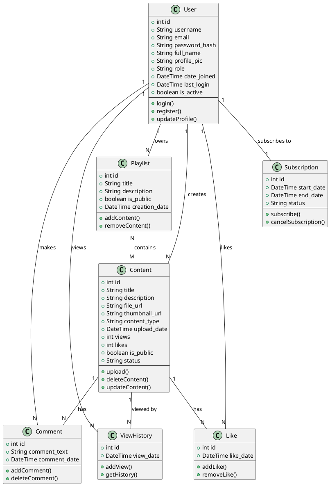

A modelagem de dados para um sistema que envolve o cadastro/login de usuários e o upload de conteúdo por criadores deve cobrir aspectos como autenticação, controle de permissões e gerenciamento de conteúdo. Abaixo está uma proposta de modelagem de dados com entidades essenciais.

### 1. **Tabela `User` (Usuário)**
Esta tabela armazenará os dados dos usuários, incluindo informações básicas e de autenticação.

| Campo           | Tipo        | Descrição                                            |
|-----------------|-------------|------------------------------------------------------|
| `id`            | `INT` (PK)  | Identificador único do usuário.                      |
| `username`      | `VARCHAR`   | Nome de usuário, único para cada usuário.            |
| `email`         | `VARCHAR`   | E-mail do usuário, único e usado para login.         |
| `password_hash` | `VARCHAR`   | Hash da senha do usuário para autenticação.          |
| `full_name`     | `VARCHAR`   | Nome completo do usuário.                            |
| `profile_pic`   | `VARCHAR`   | URL da foto de perfil do usuário (opcional).         |
| `role`          | `VARCHAR`   | Função do usuário, como "creator" ou "viewer".       |
| `date_joined`   | `DATETIME`  | Data e hora do cadastro do usuário.                  |
| `last_login`    | `DATETIME`  | Última data e hora em que o usuário fez login.       |
| `is_active`     | `BOOLEAN`   | Indica se o usuário está ativo ou foi suspenso.      |

- **Descrição**: Esta tabela mantém os dados principais dos usuários, incluindo informações de login e permissões.
  
### 2. **Tabela `Content` (Conteúdo)**
Esta tabela armazenará os dados do conteúdo carregado pelos criadores.

| Campo             | Tipo         | Descrição                                                |
|-------------------|--------------|----------------------------------------------------------|
| `id`              | `INT` (PK)   | Identificador único do conteúdo.                         |
| `user_id`         | `INT` (FK)   | Referência ao usuário criador do conteúdo.               |
| `title`           | `VARCHAR`    | Título do conteúdo.                                      |
| `description`     | `TEXT`       | Descrição detalhada do conteúdo.                         |
| `file_url`        | `VARCHAR`    | URL do arquivo de mídia (áudio ou vídeo).                |
| `thumbnail_url`   | `VARCHAR`    | URL da imagem de miniatura do conteúdo.                  |
| `content_type`    | `VARCHAR`    | Tipo de conteúdo: "audio" ou "video".                    |
| `upload_date`     | `DATETIME`   | Data e hora do upload.                                   |
| `views`           | `INT`        | Número de visualizações ou plays do conteúdo.            |
| `likes`           | `INT`        | Número de curtidas que o conteúdo recebeu.               |
| `is_public`       | `BOOLEAN`    | Indica se o conteúdo está disponível publicamente.       |
| `status`          | `VARCHAR`    | Status do conteúdo: "published", "draft", "blocked".     |

- **Descrição**: Armazena os dados de cada conteúdo enviado pelos criadores, incluindo metadados, links de arquivos e status de visibilidade.

### 3. **Tabela `Role` (Permissões de Usuário)**
Tabela para definir diferentes permissões de usuário.

| Campo      | Tipo         | Descrição                         |
|------------|--------------|-----------------------------------|
| `id`       | `INT` (PK)   | Identificador único da função.    |
| `role_name`| `VARCHAR`    | Nome da função (creator, viewer). |
| `description` | `TEXT`    | Descrição das permissões dessa função. |

- **Descrição**: Cada usuário pode ter um papel (role), como criador de conteúdo ou visualizador.

### 4. **Tabela `Playlist` (Playlist)**
Usuários podem criar listas de reprodução com o conteúdo carregado.

| Campo          | Tipo         | Descrição                                               |
|----------------|--------------|---------------------------------------------------------|
| `id`           | `INT` (PK)   | Identificador único da playlist.                        |
| `user_id`      | `INT` (FK)   | Referência ao usuário que criou a playlist.             |
| `title`        | `VARCHAR`    | Título da playlist.                                     |
| `description`  | `TEXT`       | Descrição da playlist.                                  |
| `is_public`    | `BOOLEAN`    | Indica se a playlist é pública ou privada.              |
| `creation_date`| `DATETIME`   | Data de criação da playlist.                            |

- **Descrição**: Usuários (criadores ou espectadores) podem organizar conteúdos em playlists.

### 5. **Tabela `Content_Playlist` (Conteúdo em Playlist)**
Relação entre conteúdos e playlists.

| Campo          | Tipo         | Descrição                                               |
|----------------|--------------|---------------------------------------------------------|
| `playlist_id`  | `INT` (FK)   | Referência à playlist.                                  |
| `content_id`   | `INT` (FK)   | Referência ao conteúdo.                                 |

- **Descrição**: Relaciona conteúdos específicos às playlists criadas por usuários.

### 6. **Tabela `Comment` (Comentários)**
Usuários podem comentar sobre os conteúdos.

| Campo           | Tipo        | Descrição                                                |
|-----------------|-------------|----------------------------------------------------------|
| `id`            | `INT` (PK)  | Identificador único do comentário.                       |
| `user_id`       | `INT` (FK)  | Referência ao usuário que fez o comentário.              |
| `content_id`    | `INT` (FK)  | Referência ao conteúdo comentado.                        |
| `comment_text`  | `TEXT`      | Texto do comentário.                                     |
| `comment_date`  | `DATETIME`  | Data e hora do comentário.                               |

- **Descrição**: Cada comentário está associado a um conteúdo e ao usuário que o postou.

### 7. **Tabela `Like` (Curtidas)**
Armazena as curtidas de usuários nos conteúdos.

| Campo          | Tipo         | Descrição                                               |
|----------------|--------------|---------------------------------------------------------|
| `id`           | `INT` (PK)   | Identificador único da curtida.                         |
| `user_id`      | `INT` (FK)   | Referência ao usuário que curtiu o conteúdo.            |
| `content_id`   | `INT` (FK)   | Referência ao conteúdo curtido.                         |
| `like_date`    | `DATETIME`   | Data e hora da curtida.                                 |

- **Descrição**: Registra as interações de curtidas entre usuários e conteúdos.

### 8. **Tabela `Subscription` (Assinaturas)**
Gerencia as assinaturas dos usuários para acessar conteúdos premium.

| Campo           | Tipo         | Descrição                                                |
|-----------------|--------------|----------------------------------------------------------|
| `id`            | `INT` (PK)   | Identificador único da assinatura.                       |
| `user_id`       | `INT` (FK)   | Referência ao usuário que assinou.                       |
| `start_date`    | `DATETIME`   | Data de início da assinatura.                            |
| `end_date`      | `DATETIME`   | Data de término da assinatura.                           |
| `status`        | `VARCHAR`    | Status da assinatura: "active", "canceled", "expired".   |

- **Descrição**: Registra as assinaturas dos usuários ao serviço para acessarem funcionalidades premium.

### 9. **Tabela `View_History` (Histórico de Visualização)**
Armazena o histórico de consumo de mídia de cada usuário.

| Campo          | Tipo         | Descrição                                               |
|----------------|--------------|---------------------------------------------------------|
| `id`           | `INT` (PK)   | Identificador único do histórico de visualização.       |
| `user_id`      | `INT` (FK)   | Referência ao usuário que assistiu/escutou o conteúdo.  |
| `content_id`   | `INT` (FK)   | Referência ao conteúdo visualizado/escutado.            |
| `view_date`    | `DATETIME`   | Data e hora em que o conteúdo foi acessado.             |

### Relacionamentos principais:
- **User-Content**: Cada conteúdo é criado por um usuário (relação 1:N).
- **User-Playlist**: Um usuário pode criar várias playlists (1:N).
- **Content-Playlist**: Conteúdos podem pertencer a várias playlists e vice-versa (N:M).
- **User-Like-Content**: Usuários podem curtir vários conteúdos, e cada conteúdo pode receber várias curtidas (N:M).
- **User-Comment-Content**: Um usuário pode fazer vários comentários sobre diferentes conteúdos (1:N).

Esse modelo cobre os principais aspectos de um sistema de streaming com suporte a login, upload de conteúdo e interações como curtidas e comentários.

Abaixo está a proposta de um diagrama de classes para a modelagem de dados mencionada, considerando as entidades principais, atributos e relacionamentos:

### Classes Principais:

1. **User**
   - `id: int`
   - `username: str`
   - `email: str`
   - `password_hash: str`
   - `full_name: str`
   - `profile_pic: str`
   - `role: str`
   - `date_joined: datetime`
   - `last_login: datetime`
   - `is_active: bool`
   - **Métodos**:
     - `login()`
     - `register()`
     - `updateProfile()`

2. **Content**
   - `id: int`
   - `title: str`
   - `description: str`
   - `file_url: str`
   - `thumbnail_url: str`
   - `content_type: str`
   - `upload_date: datetime`
   - `views: int`
   - `likes: int`
   - `is_public: bool`
   - `status: str`
   - **Métodos**:
     - `upload()`
     - `deleteContent()`
     - `updateContent()`

3. **Playlist**
   - `id: int`
   - `title: str`
   - `description: str`
   - `is_public: bool`
   - `creation_date: datetime`
   - **Métodos**:
     - `addContent()`
     - `removeContent()`

4. **Comment**
   - `id: int`
   - `comment_text: str`
   - `comment_date: datetime`
   - **Métodos**:
     - `addComment()`
     - `deleteComment()`

5. **Like**
   - `id: int`
   - `like_date: datetime`
   - **Métodos**:
     - `addLike()`
     - `removeLike()`

6. **Subscription**
   - `id: int`
   - `start_date: datetime`
   - `end_date: datetime`
   - `status: str`
   - **Métodos**:
     - `subscribe()`
     - `cancelSubscription()`

7. **ViewHistory**
   - `id: int`
   - `view_date: datetime`
   - **Métodos**:
     - `addView()`
     - `getHistory()`

### Relacionamentos:

1. **User - Content**: 
   - Relação 1:N (Um usuário pode criar vários conteúdos).
   - Um criador de conteúdo (`User`) possui uma coleção de conteúdos associados, o que pode ser modelado pela relação de composição entre `User` e `Content`.

2. **User - Playlist**: 
   - Relação 1:N (Um usuário pode criar várias playlists).
   - Uma playlist pode conter múltiplos conteúdos, e um usuário pode ser dono de várias playlists.

3. **Playlist - Content**: 
   - Relação N:M (Uma playlist pode ter vários conteúdos, e um conteúdo pode estar em várias playlists).
   - Essa relação pode ser representada por uma classe associativa (ou intermediária), ligando `Playlist` e `Content`.

4. **User - Comment**: 
   - Relação 1:N (Um usuário pode fazer vários comentários).
   - Um comentário sempre estará associado a um conteúdo específico.

5. **User - Like - Content**: 
   - Relação N:M (Um usuário pode curtir vários conteúdos, e um conteúdo pode ter várias curtidas).
   - A classe `Like` serve como a entidade intermediária, conectando `User` e `Content`.

6. **User - Subscription**: 
   - Relação 1:1 (Um usuário pode ter uma assinatura ativa).
   - O usuário pode se inscrever ou cancelar a assinatura.

7. **User - ViewHistory - Content**:
   - Relação N:M (Um usuário pode assistir a vários conteúdos e um conteúdo pode ser assistido por vários usuários).
   - A classe `ViewHistory` serve como entidade intermediária.

### Diagrama de Classes:

```plaintext
+----------------+       1       +-----------------+       N        +--------------+
|     User       |<----------------|    Content     |<----------------|  Playlist    |
+----------------+                 +-----------------+                +--------------+
| - id           |                 | - id            |                | - id         |
| - username     |                 | - title         |                | - title      |
| - email        |                 | - description   |                | - description|
| - password_hash|                 | - file_url      |                | - is_public  |
| - role         |                 | - content_type  |                | - creation_date|
| - date_joined  |                 | - upload_date   |                +--------------+
+----------------+                 +-----------------+                | addContent() |
| login()        |                 | upload()        |                | removeContent()|
| register()     |                 | deleteContent() |                +--------------+
+----------------+                 +-----------------+
           |                             |
           |                             | N
           | 1                           v
           v                         +----------------+
     +--------------+                 |     Comment    |
     | Subscription |                 +----------------+
     +--------------+                 | - id           |
     | - id         |                 | - comment_text |
     | - start_date |                 | - comment_date |
     | - end_date   |                 +----------------+
     | - status     |                 | addComment()   |
     +--------------+                 | deleteComment()|
     | subscribe()  |                 +----------------+
     | cancelSub()  |
     +--------------+
```

### Explicação do Diagrama:
- **User**: Centraliza a relação com conteúdos, playlists, curtidas, assinaturas, histórico de visualização e comentários.
- **Content**: Relaciona-se diretamente com o usuário que o criou e pode estar em várias playlists.
- **Playlist**: Um usuário pode criar várias playlists, que por sua vez podem conter vários conteúdos.
- **Comment** e **Like**: Representam interações dos usuários com os conteúdos.
- **Subscription**: Relaciona-se diretamente ao usuário, representando seu status de assinatura.
- **ViewHistory**: Armazena o histórico de visualização do usuário em relação aos conteúdos consumidos.

Este diagrama captura as interações principais entre os dados de usuários, conteúdo e funcionalidades relacionadas ao streaming.

Aqui está o código em PlantUML para o diagrama de classes proposto:



Você pode copiar esse código e colá-lo em um editor compatível com PlantUML para gerar o diagrama de classes. O diagrama refletirá os relacionamentos e atributos discutidos anteriormente.