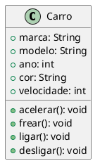
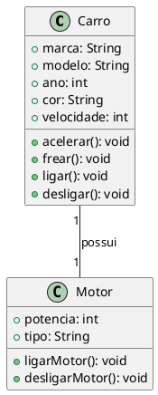
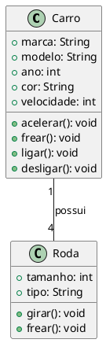
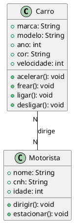
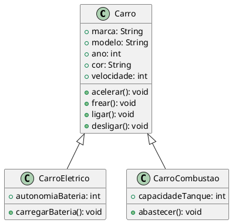
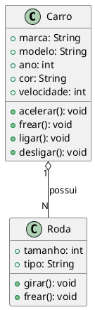
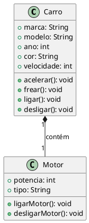
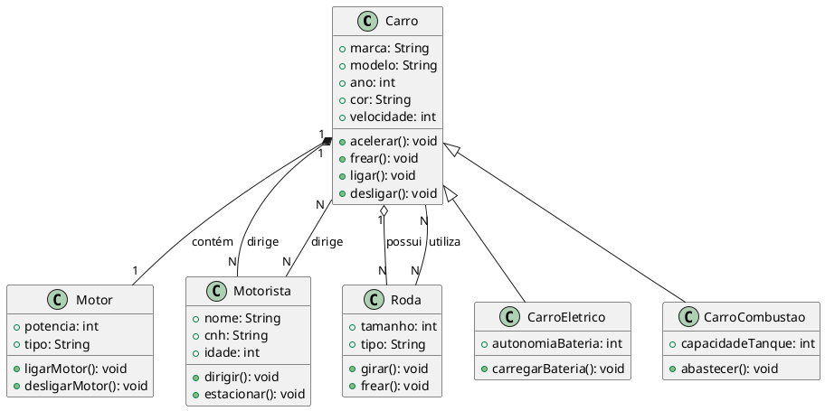

# Classes

Aqui está um exemplo básico de um diagrama de classe para a classe `Carro` usando PlantUML:

Esse diagrama representa uma classe `Carro` com atributos como `marca`, `modelo`, `ano`, `cor`, e `velocidade`, além de métodos como `acelerar`, `frear`, `ligar` e `desligar`.

### 1:1

Temos um exemplo de diagrama UML com PlantUML para ilustrar uma associação 1:1 entre as classes `Carro` e `Motor`. Nesse caso, um carro possui um único motor, e cada motor pertence a um único carro.

Neste diagrama, temos:

- Uma associação 1:1 entre `Carro` e `Motor`.
- A classe `Carro` tem atributos como `marca`, `modelo`, `ano`, `cor`, e métodos como `acelerar`, `frear`.
- A classe `Motor` tem atributos como `potencia` e `tipo`, além de métodos como `ligarMotor` e `desligarMotor`.

A relação é representada por uma linha com "1" em ambos os lados, indicando uma associação 1:1.

### 1:N

Um exemplo de diagrama UML usando PlantUML para ilustrar uma associação 1:N entre as classes `Carro` e `Roda`, onde um carro tem várias rodas, mas cada roda pertence a apenas um carro.

Neste diagrama:

- A classe `Carro` pode ter várias rodas (4, neste caso), mas cada `Roda` pertence a um único `Carro`.
- A relação 1:N é representada por "1" no lado do `Carro` e "4" no lado da `Roda`, indicando que um carro pode ter 4 rodas.

Essa é uma forma simples de representar uma associação 1:N. Você pode ajustar os números para refletir outros casos de uso, como um carro com um número variável de rodas.

### N:N

Vamos criar uma nova associação N:N para o exemplo acima, desta vez utilizando as classes `Carro` e `Motorista`, onde vários carros podem ser dirigidos por vários motoristas, e cada motorista pode dirigir vários carros.

Neste diagrama:

- A classe `Carro` mantém suas características e métodos relacionados à condução.
- A classe `Motorista` tem atributos como `nome`, `cnh` (Carteira Nacional de Habilitação), e `idade`, além de métodos como `dirigir` e `estacionar`.
- A associação N:N indica que **um carro pode ser dirigido por vários motoristas**, e **um motorista pode dirigir vários carros**, como poderia ocorrer em uma empresa de locação de veículos ou uma garagem compartilhada.

Essa relação N:N é comum em cenários onde há múltiplos motoristas e múltiplos veículos disponíveis para uso.

### Herança

Aqui está uma proposta de herança para o exemplo acima, utilizando as classes `Carro`, `CarroEletrico` e `CarroCombustao`. A classe `Carro` é a classe base, e as classes `CarroEletrico` e `CarroCombustao` herdam suas propriedades e métodos, com características específicas de cada tipo de carro.

Neste diagrama:

- A classe `Carro` é a **classe base**, contendo atributos e métodos comuns a todos os tipos de carros.
- A classe `CarroEletrico` herda de `Carro` e tem um atributo específico `autonomiaBateria` e um método `carregarBateria`.
- A classe `CarroCombustao` também herda de `Carro`, com o atributo `capacidadeTanque` e o método `abastecer`.

Essa estrutura reflete a especialização de carros em diferentes tipos, aproveitando a herança para compartilhar atributos e métodos comuns.

### Agregação

Aqui está um exemplo de diagrama UML em PlantUML para ilustrar uma agregação entre as classes `Carro` e `Roda`, onde um carro tem rodas, mas as rodas podem existir independentemente de um carro específico.

Neste diagrama:

- A classe `Carro` possui uma ou mais `Rodas`, representando uma relação de agregação.
- A notação "o--" indica que a relação é de agregação, onde um `Carro` pode ter várias `Rodas`, mas as `Rodas` podem existir sem estarem associadas a um carro específico.

Esse modelo reflete a realidade em que rodas podem ser usadas em diferentes carros ou podem ser substituídas, mantendo uma relação de dependência, mas sem um vínculo forte.

### Composição

Aqui está um exemplo de diagrama UML em PlantUML para ilustrar uma composição entre as classes `Carro` e `Motor`, onde um carro tem um motor, e o motor não pode existir independentemente do carro.

Neste diagrama:

- A classe `Carro` tem uma composição com a classe `Motor`, representada pela notação "*--".
- Isso indica que um `Carro` contém exatamente um `Motor`, e o motor não faz sentido fora do contexto do carro. Se o carro for destruído, o motor também é destruído.

Essa relação é comum em sistemas onde as partes (como o motor) são componentes essenciais do todo (como o carro) e não podem existir independentemente.

### Completo

Aqui está um diagrama completo em PlantUML que combina todos os elementos apresentados: associações, agregações, composições e heranças entre as classes `Carro`, `Motor`, `Motorista`, `Roda`, `CarroEletrico` e `CarroCombustao`.

### Explicação do Diagrama:

1. **Herança**:

   - `Carro` é a classe base, e `CarroEletrico` e `CarroCombustao` são subclasses que herdam de `Carro`.
2. **Agregações**:

   - `Carro` possui várias `Rodas` (agregação).
   - `Carro` pode ser dirigido por vários `Motoristas` (agregação).
3. **Composição**:

   - `Carro` contém exatamente um `Motor`, que não pode existir sem o carro (composição).
4. **Associações**:

   - `Carro` pode ser dirigido por vários `Motoristas`, e um `Motorista` pode dirigir vários `Carros` (associação N:N).

Esse diagrama oferece uma visão abrangente das relações entre as classes no contexto apresentado.
